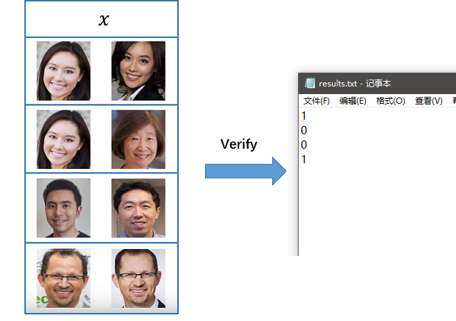
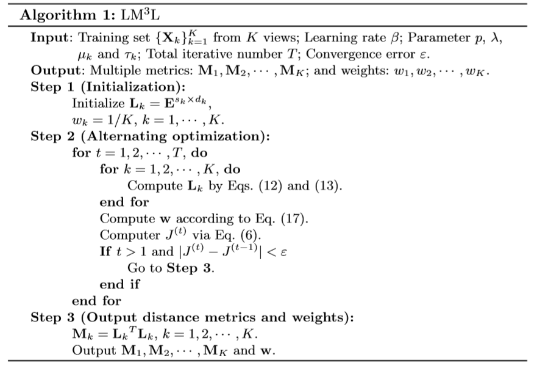
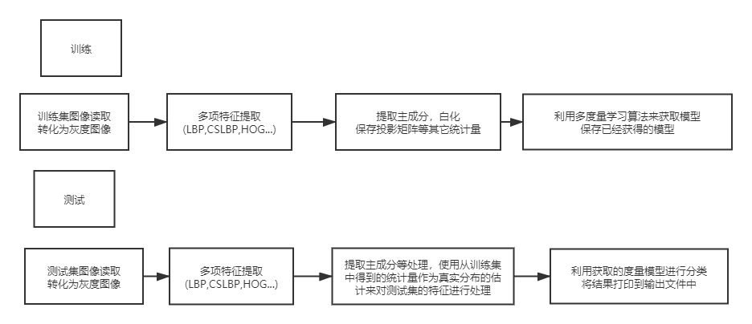

# Project Report——Face Verification

### PB17000100  李维晟 PB17051044 刘云飞 （50%/50%）

[TOC]

## 实验内容

### 描述

在本实验中，我们需要实现一个面部识别系统，它能够判定两幅包含人脸的图像是否属于同一人。

### 数据集

训练集是LFW数据集的一个子集，它包含两部分：配对图像和非配对图像，每个部分包含1600对图像。配对部分的每对图像包含的人脸同属于一人，非配对图像则属于不同的人。

总计6400幅图像，3200对，均为250×250的RGB图像，其中的主体人脸是我们需要处理的对象。

### 要求

- 输入：两幅面部图像

- 输出：1或0。当两幅图像同属一人时，期望输出1，反之输出0

- 采用F1得分作为评判标准

- 对于实现的程序来说，给定测试的图片对集合，我们需要将判定的结果输出到名为`results.txt`的文件中，如下图所示：

  


## 实验原理

### 特征提取

提取出有用的特征对于训练模型来说时至关重要的。

#### LBP

局部二值模式(Local binary patterns)是一种描述图像局部纹理的特征算子，文献[2]详细描述了这个特征。

我们采用一种 uniform pattern LBP 特征。将输入图像转为灰度图，裁剪为80·150大小，分为8·15个10·10的区块,每个区块如下操作：

- 统计每个非边缘像素点与八个周围像素点的关系，按照顺时针或逆时针的顺序，如果大于中心像素点则该位为1，否则为0，得到一个八位二进制数模式。
- 如果一个模式发生的0-1或1-0跳变少于等于2次，则该特征为uniform特征，共58组。将所有非uniform特征归为一个模式，此时一共有59组模式。
- 对每一个区块计算直方图。
- 此时，可以选择将直方图归一化；
- 串联所有区块的直方图，这就得到了当前检测窗口的特征向量。

此时，每一个区块输出为59维特征，一张图像就得到了7080维度的特征向量。

#### CSLBP

文献[3]描述了这种方法。与LBP的区别便是仅仅按照时针顺序比较一个像素点两侧的四对相反位置的像素点，得到四位二进制模式，也没有uniform的区别。

这个特征的计算量比较小，数据少，可以更好的反映梯度。

#### HOG

非常著名的特征提取方法。

- 将图像分为很多cell，每一个cell计算梯度直方图。
- 梯度直方图分为nbins个组，均匀分布在0-180之间，每个梯度的强度将会分配在两个相邻组之间。
- 再将相邻的一些cell组合为block，block之间可以重叠。
- 每一个block内的每个cell的直方图拼在一起，再进行平方归一化得到特征。
- 再将每一个block的特征拼接，得到图像的特征。

一般推荐的cell为8·8，一个block为2·2个cell，block步长为1·1个cell。


### 训练模型

#### 度量学习

度量学习(Metric learning)目前已经被广泛应用在各种模型的训练算法中，它基于马氏距离(Mahalanobis distance)来定义两个特征的相似性：
$$
d^2_{\bf M}({\bf x}, {\bf y}) = ({\bf y}-{\bf x})^\top{\bf M}({\bf y}-{\bf x})
$$
其中${\bf M}$是正定矩阵，容易验证它满足距离的良定义。可见我们需要学习的就是矩阵${\bf M}$

常见的度量学习算法往往基于某一个特征来学习对应维度的${\bf M}$，我们希望可以基于多种特征来进行度量学习，强化我们的模型性能。

####  Large Margin Multi-Metric Learning(LM3L)

该方法是一种多度量学习算法，由J.Hu等人在文献[1]中提出，可以应用于我们需要完成的任务中。接下来我们基于文献，较为具体地描述其细节。

##### 问题表示

假设我们的训练集中包含样本数为$N$, 对每个样本我们可以提取出$K$个特征，那么我们重新定义训练样本集为${\bf X} = \{{\bf X}_k \in {\mathbb R}^{d_k\times N}\}_{k=1}^K$，其中${\bf X}_k = [{\bf x}_1^k, {\bf x}_2^k, \cdots, {\bf x}_N^k]$是第$k$个样本特征集合，关于该特征集合中的任意两个样本${\bf x}_i^k, {\bf x}_j^k$，其马氏距离定义为：
$$
d^2_{{\bf M}_k}({\bf x}_i^k, {\bf x}_j^k) = ({\bf x}_i^k-{\bf x}_j^k)^\top{\bf M}_k({\bf x}_i^k-{\bf x}_j^k)
$$
其中${\bf M}_k\in {\mathbb R}^{d_k\times d_k}$应为正定矩阵。

针对我们的问题——人脸配对来说，我们当然希望两个样本同属于一个人的时候，这两个样本的特征表示之间的距离更小。形式化的说，当${\bf x}_i^k, {\bf x}_j^k$是从同一个主体提取出来的时候，它们之间的距离应该小于一个阈值$\mu_k-\tau_k(\mu_k>\tau_j>0)$，反之我们希望它们之间的距离大于$\mu_k+\tau_k$。该观察可以表示为：
$$
y_{ij}(\mu_k-d^2_{{\bf M}_k}({\bf x}_i^k, {\bf x}_j^k))>\tau_K
$$
其中$y_{ij}$当且仅当两样本能够配对时取值为1， 反之取值为-1.

为了学习${\bf M}_k$, 我们可以设计一个针对它的标准化问题：
$$
\min_{{\bf M}_k}I_k = \sum_{i,j}h(\tau_k-y_{ij}(\mu_k-d^2_{{\bf M}_k}({\bf x}_i^k, {\bf x}_j^k))
$$
其中$h(x) = \max(x,0)$为hinge损失函数。

但是我们最终的目的是学习总共$K$个度量矩阵，这使得我们关于LM3L给出的最终目标函数为：
$$
\min_{{\bf M}_1,\cdots, {\bf M}_K}J =\sum_{k=1}^K w_k^pI_k + \lambda\sum_{k, l=1, k < l}^K \sum_{i,j}(d_{{\bf M}_k}({\bf x}_i^k, {\bf x}_j^k)-d_{{\bf M}_l}({\bf x}_i^l, {\bf x}_j^l))^2\\
s.t \sum_{k=1}^K w_k = 1, w_k \ge 0, \lambda > 0， p > 1
$$
目标函数的第一项显然是加权的关于单个矩阵的目标函数，其中选择的超参数$p>1$是为了避免出现只有一个特征的权值趋近于1，其余特征的权值趋近于0的情况，也就是为了尽可能利用更多的特征。而第二项中包含相同样本对不同特征的距离之差平方的求和，是出于这样的观察：即使是基于不同的特征定义的距离，其描述的语义（指配对情况）是相似的，所以考虑在目标函数中添加该项。

##### 替代优化方案

显然，我们很难从上述目标函数的表示中找出一个全局最优解，因为我们需要同时学习$K$个度量矩阵。我们在实验中则使用了一种替代性的优化方案，它也是基于梯度下降的思想来迭代式地交替学习${\bf M}_k$和$w_k$。其整体的思路如下：

1. 固定${\bf w}$,  更新${\bf M}_k$

   在固定${\bf w}$的前提下，为了优化${\bf M}_k$, 我们还需要固定${\bf M}_1, \cdots, {\bf M}_{k-1}, {\bf M}_{k+1}, \cdots, {\bf M}_K$。那么目标函数可以写作：
   $$
   \min_{{\bf M}_k} J =w_k^pI_k+\lambda\sum_{l=1, l\not=k}^K\sum_{i,j}(d_{{\bf M}_k}({\bf x}_i^k, {\bf x}_j^k)-d_{{\bf M}_l}({\bf x}_i^l, {\bf x}_j^l))^2+A_k
   $$
   其中$A_k$是常数项。

   我们可以求得所需要的梯度：
   $$
   \begin{align}
   \frac{\part J}{\part{\bf M}_k} &= w_k^p\sum_{i,j}y_{ij}h'(z){\bf C}_{ij}^k+\lambda\sum_{l=1, l\not=k}^K\sum_{i,j}(1-\frac{d_{{\bf M}_l}({\bf x}_i^l, {\bf x}_j^l)}{d_{{\bf M}_k}({\bf x}_i^k, {\bf x}_j^k)}){\bf C}_{ij}^k \\
   &= \sum_{i,j}(w_k^py_{ij}h'(z)+\lambda\sum_{l=1, l\not=k}^K(1-\frac{d_{{\bf M}_l}({\bf x}_i^l, {\bf x}_j^l)}{d_{{\bf M}_k}({\bf x}_i^k, {\bf x}_j^k)})){\bf C}_{i,j}^k
   \end{align}
   $$
   其中$z = \tau_k-y_{ij}(\mu_k-d^2_{{\bf M}_k}({\bf x}_i^k, {\bf x}_j^k))$, ${\bf C}_{ij}^k = ({\bf x}_i^k-{\bf x}_j^k)({\bf x}_i^k-{\bf x}_j^k)^\top$, $h'(z)$为hinge函数的导数。考虑到其在0处不可导，我们采用sigmoid函数的变形来代替该导数。

   使用梯度下降的方式，我们可以得到迭代步：
   $$
   {\bf M}_k = {\bf M}_k-\beta\frac{\part J}{\part{\bf M}_k}
   $$
   其中$\beta$是学习率。

   当然在实际的实现中，这种优化方式很容易导致极慢的收敛速度；而另一方面，当数据的维数很高且训练样本数不足时很容易造成过拟合。为了缓解这种问题，我们在实现中不直接学习${\bf M}_k$。考虑低秩的线性投影矩阵${\bf L}_k \in {\mathbb R}^{s_k \times d_k} (s_k < d_k)$， 定义${\bf M}_k = {\bf L}_k^\top{\bf L}_k$，那么使用链式法则有：
   $$
   \begin{align}
   \frac{\part J}{\part{\bf L}_k} &= 2{\bf L}_k[w_k^p\sum_{i,j}y_{ij}h'(z){\bf C}_{ij}^k+\lambda\sum_{l=1, l\not=k}^K\sum_{i,j}(1-\frac{d_{{\bf M}_l}({\bf x}_i^l, {\bf x}_j^l)}{d_{{\bf M}_k}({\bf x}_i^k, {\bf x}_j^k)}){\bf C}_{ij}^k] \\
   &= 2{\bf L}_k\sum_{i,j}(w_k^py_{ij}h'(z)+\lambda\sum_{l=1, l\not=k}^K(1-\frac{d_{{\bf M}_l}({\bf x}_i^l, {\bf x}_j^l)}{d_{{\bf M}_k}({\bf x}_i^k, {\bf x}_j^k)})){\bf C}_{i,j}^k
   \end{align}
   $$
   迭代步变为：
   $$
   {\bf L}_k = {\bf L}_k-\beta\frac{\part J}{\part{\bf L}_k}
   $$
   
2. 固定${\bf M}_k$，更新${\bf w}$

   该问题比第一步要简单得多。利用拉格朗日乘子法，在目标函数中添加限制$\sum_{k=1}^Kw_k-1=0$，很容易通过求导来定出此情形下的$w_k$值
   $$
   w_k = \frac{(1/I_k)^{1/(p-1)}}{\sum_{k=1}^K(1/I_k)^{1/(p-1)}}， k=1,2,\cdots, K
   $$

最终我们可以归纳出优化所用的LM3L算法：



其中带有编号的等式均已出现在上文中。

我们将会使用该算法来训练我们的模型,出于某些原因我们也会对实现的细节做一定的修改。


## 过程实现

我们设计的流程总体上来说分为训练和测试两大部分。

下图表现了我们预期的整个流程：



我们的代码基本基于以上的流程来实现。

接下来我们对流程中的各个环节做简要描述。其中不会过多涉及代码的细节，其源码位于同文件夹下的另一文件中。

### 训练

#### 图像读取

我们通过递归遍历完成该工作，属于同一对的图像也会正好在读取到的数组中相邻。

为了消除来自背景的影响和后续处理的方便，我们对图像进行预裁剪并进行灰度转换，这样我们最终得到的图像是150×80的灰度图像，存储在np数组中。

利用我们实现的函数，可以将位于`dirpath`中的所有`.jpg`图像文件读入：

```python
images = get_imgs(dirpath)
```

#### 特征提取

原来的文献提取了Dense-SIFT,LBP,Sparse-SIFT三个特征来训练LFW训练集。但是SIFT系列特征提取的算法流程复杂，难以实现，而且受版权保护。所以我们综合考虑了CSLBP，HOG两个容易实现而且计算相对快的特征。

为了降低维度，我们都先将图像剪裁成一定尺寸，取中间部分。HOG的其余参数都取默认值。

| 特征  | 剪裁后图像尺寸 | block大小 | 输出维度 |
| ----- | -------------- | --------- | -------- |
| LBP   | 150·80         | 15·16     | 2950     |
| CSLBP | 150*80         | 10·10     | 1920     |
| HOG   | 128*64         | 8·8       | 3780     |

#### 数据降维

经由特征提取我们可以获得来自同一图像的多个特征，但是其具有的高维度会带来这样的影响：如果我们就这样将它们丢入训练算法中，生成模型会需要很久且很更容易让模型学习到一些无关紧要的特征，从而导致过拟合的发生。

基于主成分分析的思想，我们对这些特征进行降维。原来都是五千维左右的特征，我们模仿参考的文献将这些特征同一降至200维。

使用如下的代码我们可以获得降维后的数据：

```python
reduce_matrix_flbp, reduced_flbp, mean_flbp, stds_flbp = WPCA(train[0])
reduce_matrix_fhog, reduced_fhog, mean_fhog, stds_fhog = WPCA(train[1])
reduce_matrix_fcslbp, reduced_fcslbp, mean_fcslbp, stds_fcslbp = WPCA(train[2])
```

不过事实上，我们不仅需要获得降维后的数据，为了对测试集合中的数据进行归一化，还需要不同维度的统计量（均值、方差）。我们使用来自训练集中算得的统计量来对此做估计，并将这些值用于测试集特征的归一化中。

#### 模型生成

通过以上的几个步骤，我们已经获得了性质较为良好的数个特征，借由来自测试集的特征，我们可以按照实验原理中描述的LM3L训练算法来处理这些特征，得到所需的模型。

我们先描述针对原算法的一些修改：

1. 回顾我们的目标函数：
   $$
   \min_{{\bf M}_1,\cdots, {\bf M}_K}J =\sum_{k=1}^K w_k^pI_k + \lambda\sum_{k, l=1, k < l}^K \sum_{i,j}(d_{{\bf M}_k}({\bf x}_i^k, {\bf x}_j^k)-d_{{\bf M}_l}({\bf x}_i^l, {\bf x}_j^l))^2\\
   s.t \sum_{k=1}^K w_k = 1, w_k \ge 0, \lambda > 0， p > 1
   $$
   其中的正则化项和梯度中都有涉及到$i,j$的求和。然而在实际的训练中，我们使用image-restricted的学习范式：这指的是我们的训练对象以严格的对为单位，不允许结合来自不同图像对中的图像来进行优化。如此以来，上述提到的求和对我们的数据集来说实际上相当于指具有线性复杂度，即只对来自同一个图像对中的特征矢量进行求和项运算。这样能够使我们的训练过程加快。

2. 考虑到原来的算法中有数次出现除法运算，而其中又由变量作为分母，这在训练的后期有可能会出现“除以零”的异常发生。为了避免这种现象，我们采用另一种正则化的策略：对于在算法中出现的除法运算，我们按照下述途径进行替代，其中$A,B$是变量：
   $$
   \frac{1}{A} \Rightarrow \frac{1}{\sqrt{A^2+\epsilon}}\\
   \frac{B}{A} \Rightarrow \frac{\sqrt{B^2+\epsilon}}{\sqrt{A^2+\epsilon}}
   $$
   其中$\epsilon$被设为一个很小的量，在本实验中一概取$\epsilon = 1\times10^{-5}$.、

在我们的实现中，将LM3L设置为一个类，其`__init__`方法可以让我们设置相关的超参数或直接使用默认的参数;`training`方法在给定特征集合和标签集合时可以用于训练，它将得出的模型和一些需要的参数存储在对象内部；`testing`方法在给定测试集的特征集合时会根据已有的模型和参数来计算判定结果，输出一个表示结果的矢量。

训练时按下述调用即可：

```python
LM3L = LM3L_classifier()
M, w = LM3L.training(features, train_label, len(features))
```

其中`M,w`分别是输出的度量矩阵和权矢量，它们和其它参数同时被保存在模型对象`LM3L`内部用于测试时的调用。

### 测试

#### 特征提取与转化

特征提取部分实际上同训练的部分是一致的，不过对于如下的归一化我们需要来自训练集的统计量：
$$
X \Rightarrow \frac{X-\mu}{\sigma}
$$
毕竟对于测试集来说，在其含少量样本的情况下用其统计量来估计真实参数是不现实的，所以我们用来自训练集的统计量对其进行归一化操作。除此之外，我们使用来自训练集的投影矩阵来对测试集的特征进行降维。

```python
test[0] = test_WPCA(test[0], reduce_matrix_flbp, mean_flbp, stds_flbp)
test[1] = test_WPCA(test[1], reduce_matrix_fhog, mean_fhog, stds_fhog)
test[2] = test_WPCA(test[2], reduce_matrix_fcslbp, mean_fcslbp, stds_fcslbp)
```

#### 分类测试

有了训练完成的模型，其测试也相当简单，只需要调用`testing`函数即可：

```python
dists, result = LM3L.testing(test_feature)
```

不过有一点需要说明的是，在训练的过程中，我们期望:
$$
y_{ij}(\mu_k-d^2_{{\bf M}_k}({\bf x}_i^k, {\bf x}_j^k))>\tau_k
$$
但在实际的测试中，经常会有距离落到$\mu-\tau$内，此时我们只采用$\mu$作为分类的阈值，而$\tau$的作用则只体现在训练中，为的是增强训练的效果。


以上便是对基本实现流程的说明。


## 实验总结

### 结果总结

由于本实验在实际测试之前没有给定测试集，我们的做法是将训练集再次划分为训练集和测试集，能够是我们对模型的性能有个预判。为此我们实现了一个随机划分函数来对此进行操作，我们统一将训练集和测试集划分为$4:1$的比例。

在数次测试中，我们尝试了多种特征的组合以及参数的调整，最终调整周期，以算法达到终止条件为标准完成了一系列对模型性能的评估，其结果如下表所示：

| 编号 | 特征            | accuracy  | precision | recall | F1-score | 备注             |
| ---- | --------------- | --------- | --------- | ------ | -------- | ---------------- |
| 1    | HOG             | 0.684375  |           |        |          | $\beta=1, T=50$  |
| 2    | LBP             | 0.6546875 |           |        |          | $\beta=1, T=50$  |
| 3    | LBP, HOG        | 0.66875   |           |        |          | $\beta=1, T=50$  |
| 4    | LBP, HOG, CSLBP | 0.68125   | 0.66667   | 0.725  | 0.694611 | $\beta=1, T=300$ |
|      |                 |           |           |        |          |                  |

可见其F1-score可以接近0.7.

这个效果实际上并不够好，原文献中的结果在LFW数据集中可以达到0.9的accuracy。经过思考，我们觉得可能有诸多因素使我们的得分不够高：

- 数据集大小的限制。文献中的数据集大小是我们的两倍有余，这使得文献的工作不仅有更强的数据基础，还能使得特征提取的环节中可以支持更高维的特征。我们提取的特征也是处于这方面考虑而使用更低的维度数量。
- 算法细节的修改。我们不能保证我们的算法实现的过程能够完全与文献中相同，更何况为了避免一些异常情况的发生，我们对算法的一些细节进行了修改，这可能会造成结果的偏差。
- 。。。

### 可能的改进方案

本次实验由于我们的起步比较晚，时间的限制让我们没能够完全发挥该模型的能力。不过还是可以基于以获得的结果来对我们的实验进行一定程度的改进。

我们简要叙述值得一试的改进思路：

- 使用更多的特征种类(如SIFT)，减小特征提取中的块划分，获取更高维的特征，获取更有利的特征并更好地发挥模型本身的优点。
- 使用手动实现的方式来提取特征比来自opencv库的方式要慢，可以优化特征提取的算法来提高速度。
- 算法的时间复杂度随着特征提取的种类数以二次增长，我们可以考虑开多线程来进行优化，提高训练速度。
- 使用模型提升和融合技术，集成多个模型以降低泛化误差，提高模型的性能。
- 。。。

无论如何，终归有诸多值得做的工作。如有充裕的时间，我们还可以尝试更多的模型，比如深度神经网络等。

### 感想

本次实验中，我们运用这学期所学习的知识，基于文献了解并实现了一个机器学习的模型，尽管测试效果差强人意，但这还是令人激动的。在实际展开工作前，我们还是没有正确地估计本实验所需的工作量，从而导致我们在实际的实验过程中还是做得比较仓促，没能够以最好的状态完成工作。但从好的一点来说，这也让我们认识到了实际完成工程的不易，有很多实际且细节的问题只能在实践中发现和解决。

总而言之，本次实验中我们学到了不少，也发现了不少问题。我们会将这次的经验运用到以后的学习和工作中。


## 参考文献

[1] Large Margin Multi-Metric Learning for Face and Kinship Verification in the Wild [https://ieeexplore.ieee.org/document/7894195/citations#citations]

[2] Face description with local binary patterns: Application to face recognition [http://citeseerx.ist.psu.edu/viewdoc/download?doi=10.1.1.456.1094&rep=rep1&type=pdf]

[3] Description of Interest Regions withCenter-Symmetric Local Binary Patterns [http://www.ee.oulu.fi/research/mvmp/mvg/files/pdf/pdf_750.pdf]